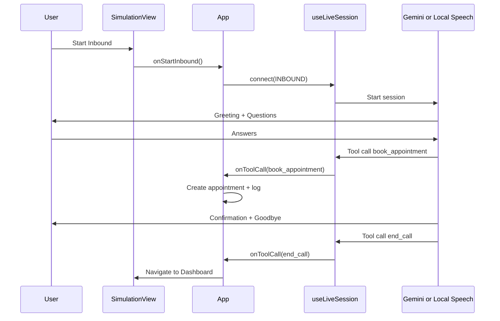
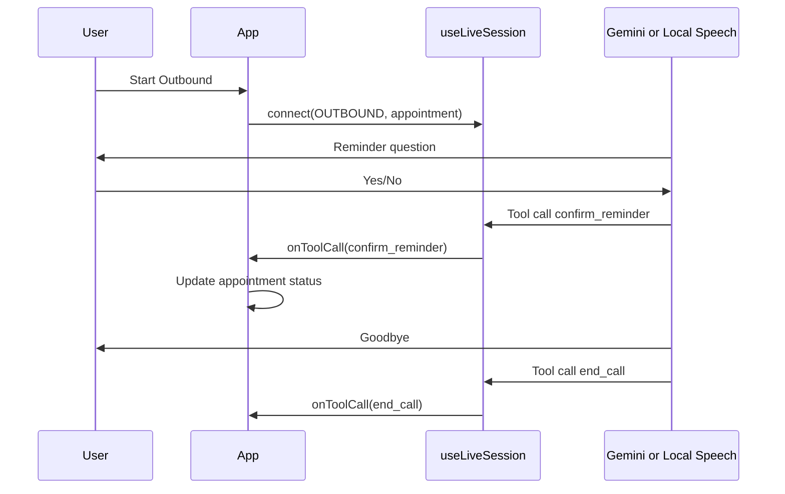
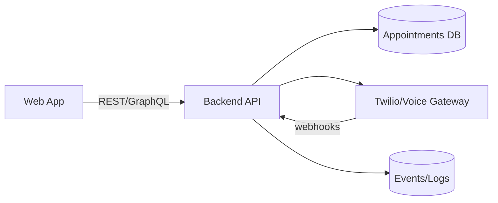

# Technical Design Document (TDD) — SehatAI Voice Receptionist (MVP)

Date: 2026-02-05

## 1. Overview
SehatAI is a voice-enabled virtual receptionist that simulates inbound booking and outbound reminder calls for clinics in Pakistan. The MVP is a browser-only React + TypeScript app with two execution paths:
- Gemini realtime voice (primary)
- Local Web Speech fallback (no API key)

Key references:
- Product requirements: [PRD.md](PRD.md)
- Rebuild blueprint: [REBUILD_DOC.md](REBUILD_DOC.md)
- Main app logic: [App.tsx](App.tsx)
- Call/session orchestration: [hooks/useLiveSession.ts](hooks/useLiveSession.ts)

## 2. Goals and Non-Goals
### Goals
- End-to-end demo of inbound booking and outbound reminders
- Urdu (Roman) first voice experience with English support for names/times
- No backend required; in-memory state
- Dual-mode operation (Gemini + local speech)

### Non-Goals
- Telephony (PSTN), call recording, persistent storage
- Medical advice or triage
- Multi-tenant auth, role-based access

## 3. Architecture Summary
The app is a single-page React app that connects to either Gemini realtime audio or local Speech APIs. App state (appointments, logs, call state) is held in memory and propagated to views.

Mermaid: System Overview
```mermaid
flowchart LR
  UI[React UI Views] -->|User actions| APP[App State + Orchestration]
  APP -->|connect()| SESSION[useLiveSession Hook]
  SESSION -->|Gemini mode| GEMINI[Google Gemini Live API]
  SESSION -->|Local mode| SPEECH[Web Speech API]
  APP -->|tools| TOOLS[Tool Handlers in App]
  TOOLS -->|mutate| STATE[(In-memory Appointments + Logs)]
  STATE --> UI
```

## 4. Frontend Components and Responsibilities
- [App.tsx](App.tsx)
  - Central state container
  - Tool execution handler (`book_appointment`, `confirm_reminder`, `end_call`)
  - View routing (Home, Simulation, Dashboard)
- [hooks/useLiveSession.ts](hooks/useLiveSession.ts)
  - Audio capture, streaming, and playback
  - Gemini realtime session lifecycle
  - Local fallback flow with SpeechRecognition + SpeechSynthesis
- Views
  - [components/views/HomeView.tsx](components/views/HomeView.tsx): marketing intro + navigation
  - [components/views/SimulationView.tsx](components/views/SimulationView.tsx): call controls, visualizer, logs
  - [components/views/DashboardView.tsx](components/views/DashboardView.tsx): appointments list + KPIs
- Utilities
  - [utils/audioUtils.ts](utils/audioUtils.ts): PCM and resampling helpers
- Types and constants
  - [types.ts](types.ts), [constants.ts](constants.ts)

## 5. Core Data Model
Defined in [types.ts](types.ts).

Appointment
- id: string
- patientName: string
- phoneNumber: string
- isNewPatient: boolean
- dateTime: string
- status: booked | confirmed | cancelled | pending

LogEntry
- id, timestamp, type, message, details

LastAction
- id, type, title, description, status

In-memory data is seeded from [constants.ts](constants.ts).

## 6. Call Modes and Flows
### 6.1 Inbound Booking Flow (Happy Path)
1. User starts inbound call from Simulation view
2. AI greets and collects name, phone, new/returning, preferred time
3. AI confirms details
4. On confirmation, tool call `book_appointment` executes
5. AI says goodbye and tool call `end_call` ends session
6. UI navigates to Dashboard

Mermaid: Inbound Sequence


### 6.2 Outbound Reminder Flow (Happy Path)
1. User starts outbound call
2. App selects a pending appointment
3. AI asks confirmation
4. On yes/no, tool call `confirm_reminder` updates status
5. AI says goodbye and ends call

Mermaid: Outbound Sequence


## 7. Tooling and Interface Contracts
Tools are defined by the Gemini session in [hooks/useLiveSession.ts](hooks/useLiveSession.ts) and executed in [App.tsx](App.tsx).

Tool: book_appointment
- Inputs: patientName, phoneNumber, isNewPatient, dateTime
- Output: { success, appointmentId }
- Side effects: add appointment, log, notification, lastAction

Tool: confirm_reminder
- Inputs: appointmentId, confirmed, patientName (optional fallback)
- Output: { success, status }
- Side effects: update appointment status, log, notification, lastAction

Tool: end_call
- Inputs: none
- Output: { success }
- Side effects: disconnect session, navigate to dashboard after grace delay

## 8. Local Fallback Logic
When `VITE_USE_GEMINI !== 'true'` or API key is absent:
- `SpeechRecognition` provides transcripts
- `SpeechSynthesis` provides TTS responses
- A simple state machine inside `useLiveSession` tracks stages

Local state stages (Inbound)
- collect_name -> collect_phone -> collect_new -> collect_time -> confirm_details -> complete

Local state stages (Outbound)
- outbound_confirm -> complete

## 9. Audio Pipeline (Gemini Mode)
- Microphone capture via `getUserMedia`
- AudioContext at OUTPUT_SAMPLE_RATE (24k)
- Input stream converted Float32 -> PCM Int16
- Base64 encoded and sent via Gemini realtime input
- Model audio returned as PCM Int16, decoded, scheduled for playback

## 10. Error Handling and Resilience
- Missing API key triggers local mode
- SpeechRecognition missing or errors -> connection error state
- On Gemini interruptions: stop scheduled audio and reset timeline
- Tool call failures logged and returned to model

## 11. Security and Privacy
- No persistent storage; all data in memory (MVP)
- Browser permissions required for microphone
- API key stored in env and only used in client

Planned improvements:
- Proxy backend to protect API keys
- Consent notices for audio capture
- Optional redaction of phone numbers in logs

## 12. Observability
- In-app logs with type tags (info/tool/error/transcription)
- Visual status (connected/connecting/error)
- Notification toasts for success and error

## 13. Performance Considerations
- Audio processing is lightweight but continuous; avoid unnecessary re-renders
- Logs can grow; consider capped log size if sessions are long
- Visualizer uses requestAnimationFrame only when active

## 14. Deployment
- Frontend-only static build (Vite)
- Environment variables: `VITE_API_KEY`, `VITE_USE_GEMINI`
- Hosting: Vercel or Netlify

## 15. Testing Strategy (MVP)
- Manual E2E in Chrome/Edge
- Mock tool calls and verify UI updates
- Validate local fallback without API key

Potential automated tests (future):
- Unit tests for `audioUtils`
- Component tests for views
- Integration test for tool execution

## 16. Risks and Mitigations
- Speech API availability: local fallback + browser guidance
- Model hallucinating appointment IDs: fuzzy name match in tool handler
- No persistence: explicit MVP messaging and demo expectations

## 17. Future Backend (Implied Architecture)
If a backend is introduced, the following services are expected:
- API service for appointments CRUD
- Auth and tenant management for multi-clinic
- Webhook/telephony gateway (Twilio)
- Audit logs and analytics

Mermaid: Future Backend Extension


## 18. Open Questions
- Should outbound calls allow manual target selection instead of auto-pending?
- Do we need time parsing/normalization for local mode?
- Should the confirmation script be customizable per clinic?
